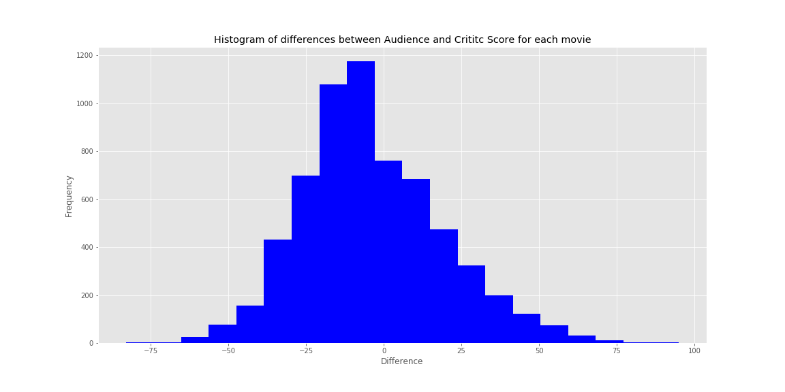

# Rotten Tomatoes

## Background

>As an avid movie watcher, I often find myself looking up a movie to see what reviews it has before I watch it. However I often times wonder whether the critical review of a movie is a good indicator of whether I, or most people will actually enjoy the movie or not. Movie critics have a reputation for being snobbish, and I was curious as to whether this is true. In order to test this, I decided to look at movie reveiws from Rotten Tomatoes. Rotten Tomatoes is a website in which movies are listed with a review score that professional critics have given it, as well as an audience score.

## Questions/Objectives

> The questions that I want to answer with this study are as follows:
1) Do critics or audiences give better ratings on average?
2) Is a critic score a good indicator of  what the audience will score a movie?
3) What is the probability that a critic score and an audience score will be very similar?

## Tools

>1) Web Scraping : Beautiful Soup, Selenium, Python 3, Docker, MongoDB.

>2) Data Cleaning and Manipulation: Python3, Numpy, Pandas.

>3) EDA and Statistical Tests: Python3, Numpy, Pandas, Matplotlib, Scipy.

## Exploratory Data Analysis

>I scraped about 6335 movies from Rotten Tomatoes. I did not include movies where there was a missing rating as I would not be able to use it for analysis.

>I first looked at a histogram of the data to get a feel for the difference between critic and audience scores.

>I instantly noticed that the critic scores appear to be higher than the average scores. Critics appear to be more likely to give a movie a high rating.

>I also looked at the frequenct in which each group rated a movie 'fresh' or 'rotten' which supports this as well.

## Statistical Tests

Test 1:
> I first ran a test to verify that the means of both groups ratings are not equal.

>My Hypotheses were as follows:
1) Ho: Critic Score Mean = Audience Score Mean
2) Ha: Critic Score Mean != Audience Score Mean

> I got a P-value of 7.169x10-18 and my alpha was 0.05 so I rejected the null. Verifying that the means are not equal.

Test 2:
> I now wanted to check if the means were within 5 points of each other.

>I set up my experiment as follows:
1) Ho: Audience Score Mean - Critic Score Mean <= 5
2) Ha: Audience Score Mean - Critic Score Mean > 5

>I went about testing this by creating a function that added each number between 1 and 5 to all the critic scores and then ran a t-test for each one against the audience score. I also applied the bonferroni correction to make sure my results would be accurate. If any of the tests failed to reject the null, then I concluded that the the mean audience score - the mean critic score was less than or equal to 5. 

>After running this function I Failed to reject the null hypothesis with a P value of 0.06.

>Looking at a histogram of the differences between audience and critic scores reflects this.

Additional Calculations:
> I also wanted to know what the probability that a critic score would be within 5 points of the corresponding audience score so I created a function to compute it. I ran the function for a multiple different ranges and received the following output. 

## Conclusion and Future Analysis

>Based off of my analysis, critics on average give higher ratings for movies than audiences do. Also, the average rating an audience gives movies is within 5 points of the critic rating, and the probability that any randomly selected audience score will have a critic score within 5 points is 17.47%. This is contrary to what I expected, as I thought critics were a lot harsher and that there would be a larger difference between the two ratings. However even, though the mean ratings are close to each other, there is still alot of variation as shown in the graph below.

> In the future I will look into scraping reviews from multiple different websites rather than just 1. Also I will look at the relationship between movie ratings and the budget for a movie.

## References

https://www.rottentomatoes.com/browse/dvd-streaming-all/

